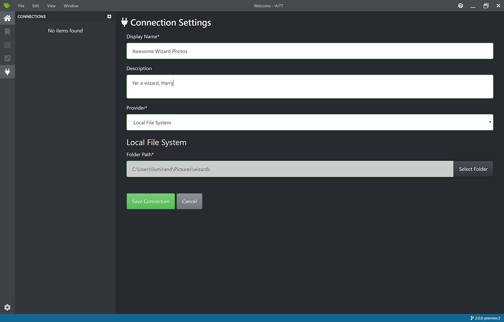
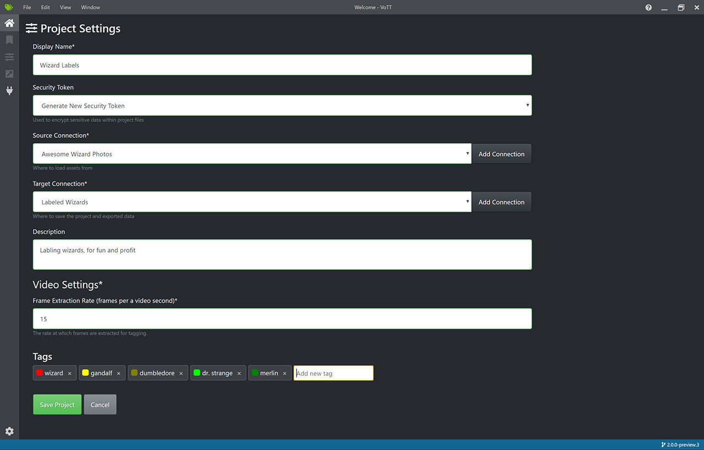
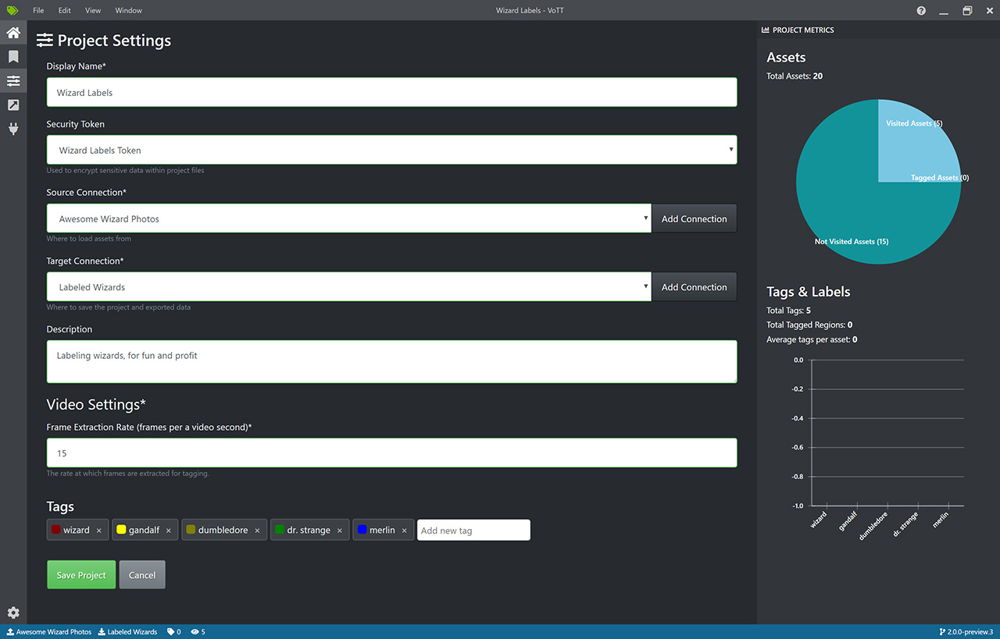
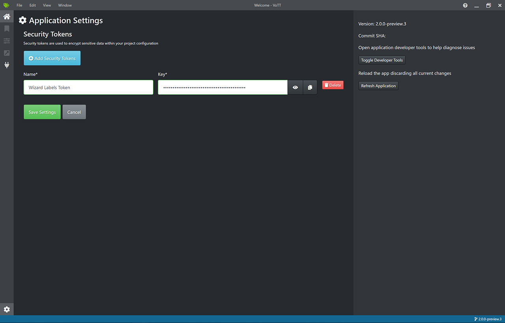
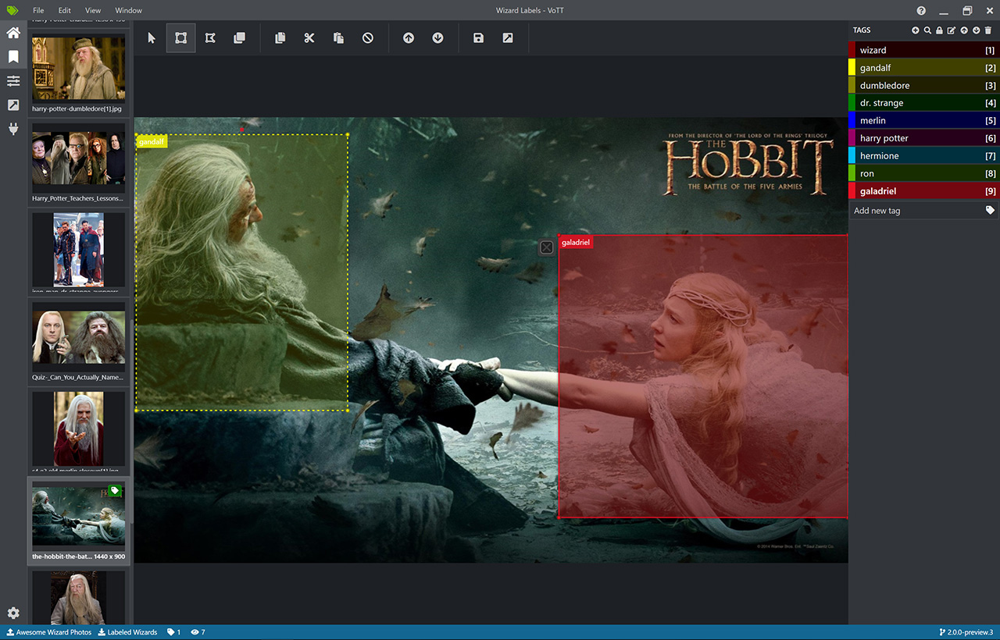

# Indian-Number-Plate-Dataset---voTT
## Setting up voTT ##
 
 `git clone https://github.com/Microsoft/VoTT.git` 
 `cd VoTT` 
 `npm ci` 
 `npm start` 
*Note* On Winodows you need to install Git BASH https://gitforwindows.org/
## Using VoTT

### Creating Connections

VoTT is a 'Bring Your Own Data' (BYOD) application. In VoTT, connections are used to configure and manage source (the assets to label) and target (the location to which labels should be exported).

Connections can be set up and shared across projects. They use an extensible provider model, so new source/target providers can easily be added.

Currently, VoTT supports:

* [Azure Blob Storage](https://docs.microsoft.com/en-us/azure/storage/blobs/storage-blobs-introduction)
* [Bing Image Search](https://azure.microsoft.com/en-us/services/cognitive-services/bing-image-search-api/)
* Local File System

To create a new connection, click the `New Connections` (plug) icon, in the left hand navigation bar:

### Creating a New Project

Labeling workflows in VoTT revolve around projects - a collection of configurations and settings that persist.

Projects define source and target connections, and project metadata - including tags to be used when labeling source assets.

As mentioned above, all projects require a source and target connection:

* **Source Connection** - Where to pull assets from
* **Target Connection** - Where project files and exported data should be stored

#### Project Settings

Project settings can be modified after a project has been created, by clicking on the `Project Setting` (slider) icon in the left hand navigation bar. Project metrics, such as Visited Assets, Tagged Assets, and Average Tags Per Asset can also be viewed on this screen.

#### Security Tokens

Some project settings can include sensitive values, such as API keys or other shared secrets. Each project will generate a security token that can be used to encrypt/decrypt sensitive project settings.

Security tokens can be found in `Application Settings` by clicking the gear icon in the lower corner of the left hand navigation bar.

**NOTE:** Project files can be shared among multiple people. In order to share sensitive project settings, *all parties must have/use the same security token.*

The token name and key **must** match in order for sensitive values to be successfully decrypted.

### Labeling an Image

When a project is created or opened, the main tag editor window opens. The tag editor consists of three main parts:

* A resizeable preview pane that contains a scrollable list of images and videos, from the source connection
* The main editor pane that allows tags to be applied to drawn regions
* The tags editor pane that allows users to modify, lock, reorder, and delete tags

Selecting an image or video on the left will load that image in the main tag editor. Regions can then be drawn on the loaded asset and a tag can be applied.

As desired, repeat this process for any additional assets.

